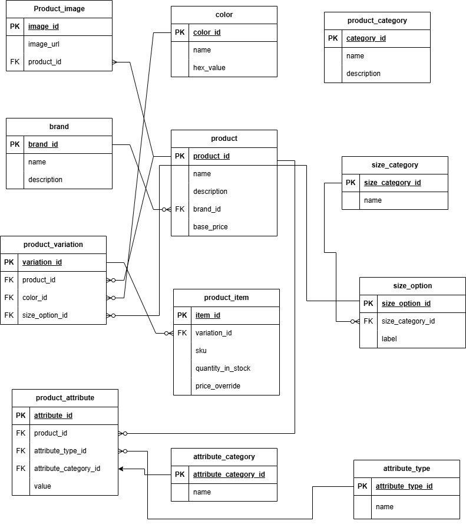

# E-commerce Database Design

The project is part of the Power Learn Project database module group assignment. It includes an Entity-Relationship Diagram (ERD) and SQL file to design and implement a database for an e-commerce platform.

**Cohort:** 2025 February  
**Group:** 22

---

## 📌 Project Overview

This database is designed to support an e-commerce platform with features including:
- Product listings
- Product variations (size, color)
- Stock management
- Brand and category classification
- Custom product attributes

---

## 🗃️ Database Tables

Key tables in the schema:
- `brand`
- `product_category`
- `product`
- `product_image`
- `color`
- `size_category`
- `size_option`
- `product_variation`
- `product_item`
- `attribute_category`
- `attribute_type`
- `product_attribute`

---

## 🧩 ERD (Entity-Relationship Diagram)

  
> The ERD illustrates all tables, relationships, primary keys, and foreign keys used in the database.

---

## ⚙️ Files

| File | Description |
|------|-------------|
| `ecommerce.sql` | SQL script to create all tables and constraints |
| `ERD.jpg` | Visual diagram of the database schema |

---

## 🤝 Group Collaboration

This project was built collaboratively by the following members of the Power Learn Project group:

- **Evanson Kimani** - kimanievansonk@gmail.com
- **emmanuel	too** -	tooemmanuel94@gmail.com
- **toheeb	babalola** - naijafighters@gmail.com

--

## License

This project is for educational purposes only.
